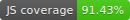

# FlashCards app &nbsp;&nbsp;&nbsp;&nbsp;  

This project is a simple [flashcards application](https://flashcards-jb.herokuapp.com/).

## Technologies
* Ruby 2.6.5
* Rails 6.1.3
* Postgres 14.3
* React 16.8.3
* Redux 4.0.1
* Webpack 4.41.2
* Node 16.15.1
* PostCSS
* Minitest
* Jest
* Enzyme

## Project Status
Work in progress.

## Run on docker
### Prepare your Docker containers:
* `docker-compose build`
* `docker-compose run --rm runner yarn install`
* `docker-compose run --rm runner ./bin/setup`

### Run rails server
* `docker-compose up rails webpacker`

### Run tests
* `docker-compose run --rm runner rails test`
* `docker-compose run --rm runner yarn install && yarn test`

## Run on local machine
### Install
* `yarn install`
* `bundle install`
* `rails db:setup`
* `rails test`
* `yarn test`

### Development
To run server in development with hot module replacement `overmind s -f Procfile.dev`

### Running tests
* `rails test`
* `yarn test`

### Running tests with coverage
* `COVERAGE=true rails test`
* `yarn test --coverage`

## Author
[Julia Bazhukhina](https://github.com/JulaB)

## License
MIT
